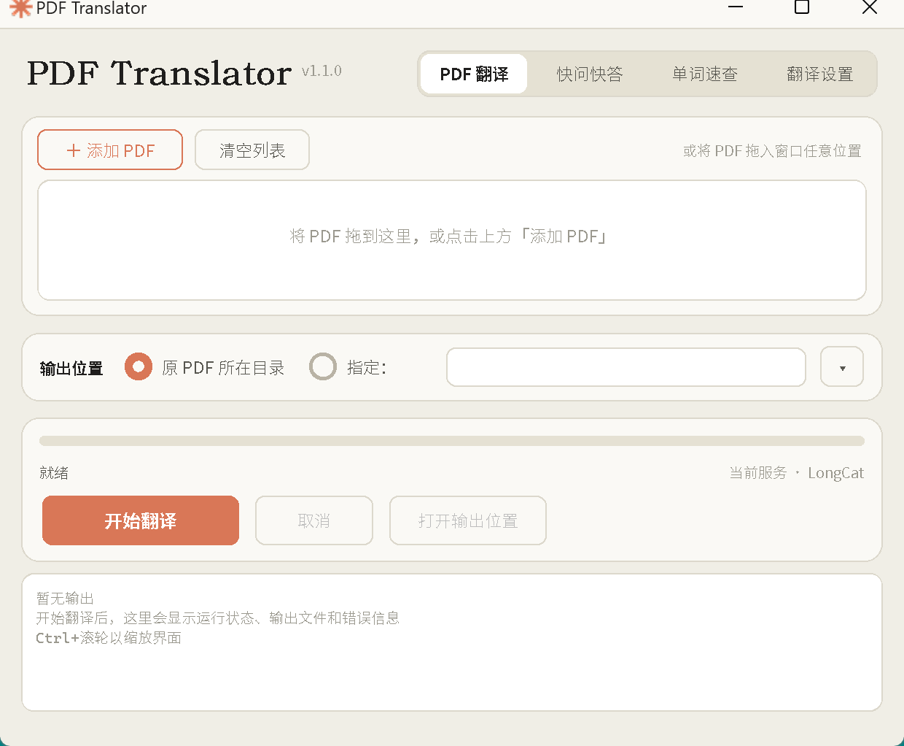
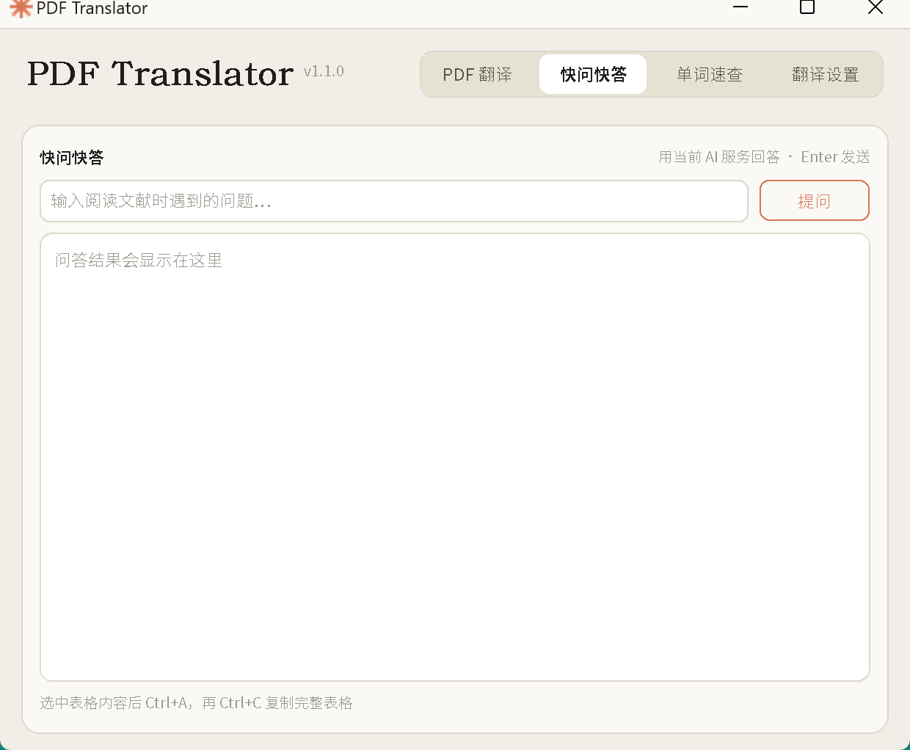
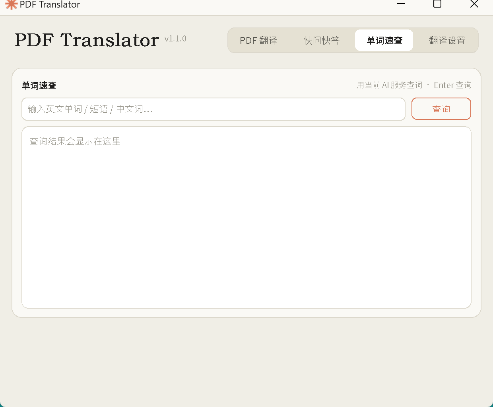
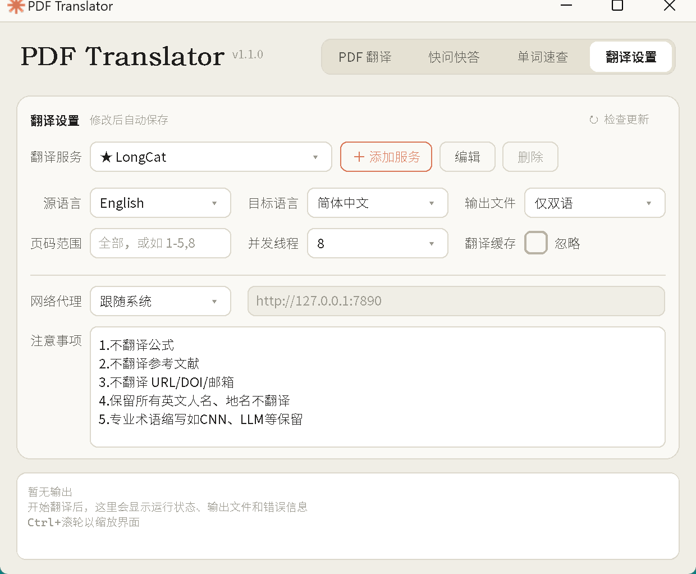

# pdf2zh-gui

一个基于 [pdf2zh](https://github.com/Byaidu/PDFMathTranslate) 的 Windows 桌面 GUI（应用名：PDF Translator），用来把英文 PDF 文献翻译成中文并输出双语 PDF / 纯译文 PDF。

项目重点是双击即用：不需要启动 Web 服务，也不需要浏览器页面。

## 功能

- 拖拽或选择多个 PDF 文件
- 主界面分为「PDF 翻译」「快问快答」「单词速查」「翻译设置」四个选项卡
- 支持页码范围、输出目录、输出文件类型和并发线程设置
- 翻译注意事项：把自定义要求注入翻译提示词，自动记住上次填写内容
- 快问快答：调用翻译设置中的 AI 服务，适合阅读文献时临时提问，支持 Markdown 渲染和最近对话上下文
- 单词速查：调用所选 AI 服务即时查词，释义语言跟随「目标语言」，支持音标和领域释义，结果区支持 Markdown 渲染
- 模型列表支持「获取可用模型」后通过右侧下拉选择；长列表会限高并滚动，不会自动覆盖输入框
- **网络代理可配置**：跟随系统 / 直接连接 / 自定义，设置同时作用于 GUI 请求和 pdf2zh 翻译请求
- **请求失败自动重试**：超时、429、5xx 会按指数退避重试，长文献不会因单次抖动整篇失败
- **API Key 使用 Windows DPAPI 加密后落盘**，只有当前 Windows 账户能解密
- Ctrl+滚轮 缩放整个界面（70%–160%），Ctrl+0 复原；自动记住缩放比例和窗口尺寸
- 自动保存翻译服务、语言、输出模式、页码、线程、缓存、注意事项、代理和输出目录等设置
- 支持 OpenAI 兼容、Claude/Anthropic 兼容、DeepSeek、Gemini、智谱、SiliconFlow、Grok、Groq、Ollama、Azure OpenAI 等服务
- 支持 LongCat 这类 Anthropic-compatible `/messages` 网关
- 翻译设置内可检查 GitHub 更新并自动拉取；每天静默检查一次，无 Git 环境时回落为下载压缩包更新
- 自动创建桌面快捷方式
- GUI 内管理翻译服务配置，API Key 只保存在本机用户配置目录

## 界面预览









## 一键安装

需要已安装 Python 3.11+ 和 [Git for Windows](https://git-scm.com/download/win)，并确保 `git` 命令已加入 PATH。

在 Windows PowerShell 中运行：

```powershell
powershell -NoProfile -ExecutionPolicy Bypass -Command "irm https://raw.githubusercontent.com/YanRuiZhan/pdf2zh-gui/main/install.ps1 | iex"
```

安装脚本会：

- 使用 `git clone` 将本仓库安装到 `%LOCALAPPDATA%\pdf2zh-gui`（已安装过则原地 `git pull`，保留虚拟环境）
- 在安装目录下创建独立虚拟环境 `.venv`，依赖只装在这里，**不会污染系统 Python 或 conda 环境**
- 安装 `requirements.txt` 中的 Python 依赖
- 在桌面创建 `PDF Translator.lnk`，指向 `.venv` 里的 `pythonw.exe`
- 使用项目内置图标

安装目录会保留完整 Git 仓库，因此 GUI 内的「检查更新」可以直接获取并拉取 GitHub 最新版本。

可选参数：

```powershell
# 指定基础 Python
$env:PDF2ZH_GUI_PYTHON="C:\Path\To\python.exe"

# 不建虚拟环境，直接装进当前 Python（不推荐）
$env:PDF2ZH_GUI_NO_VENV="1"
```

> 运行远程脚本前，建议先打开 `install.ps1` 检查内容。脚本不会读取、提交或上传你的 API Key。

## Codex 一键配置提示词

把下面这段粘贴给 Codex：

```text
请在这台 Windows 电脑上安装 pdf2zh-gui。不要读取、打印或提交我的 API Key。

请执行：
powershell -NoProfile -ExecutionPolicy Bypass -Command "irm https://raw.githubusercontent.com/YanRuiZhan/pdf2zh-gui/main/install.ps1 | iex"

安装完成后，确认桌面存在“PDF Translator”快捷方式，并告诉我安装目录。
```

## 手动运行

```powershell
git clone https://github.com/YanRuiZhan/pdf2zh-gui.git
cd pdf2zh-gui
python -m venv .venv
.\.venv\Scripts\python.exe -m pip install -r requirements.txt
.\.venv\Scripts\pythonw.exe pdf2zh_gui.py
```

也可以双击 `pdf_translator.bat`，它会优先使用同目录下的 `.venv`。

## 配置翻译服务

首次启动后，在 GUI 里点击“添加服务”。

翻译服务下拉框只显示 GUI 内添加的自定义服务（带 `★` 前缀）。如果你以前在 pdf2zh 的 `config.json` 里配置过 `google`、`bing`、`deepseek`、`openailiked` 等旧服务，它们不会再混入 GUI 下拉列表；需要在本软件里重新添加为自定义服务。

LongCat / Claude 兼容服务可选：

- 类型：`Claude 兼容`
- Base URL：填写你的服务商给出的 Anthropic-compatible 地址
- API Key：填写你自己的 Key
- 模型名称：填写你的模型名

本软件的配置保存在本机：

```text
%USERPROFILE%\.config\PDFMathTranslate\gui_services.json
%USERPROFILE%\.config\PDFMathTranslate\gui_prefs.json
```

`gui_services.json` 保存你添加的服务地址、模型名和 API Key，其中 **API Key 会用 Windows DPAPI 加密**（形如 `enc:v1:...`），换电脑或换 Windows 账户后需要重新填写。`gui_prefs.json` 保存界面偏好和翻译设置。它们都是个人配置，不应提交到 GitHub。

如果你的电脑上还有 `%USERPROFILE%\.config\PDFMathTranslate\config.json`，那是 pdf2zh 的旧配置文件，也可能包含明文密钥；本 GUI 不会把其中的旧服务直接显示在「翻译服务」下拉框中。

## 网络代理

「翻译设置 → 网络代理」提供三种模式：

| 模式 | 行为 |
| --- | --- |
| 跟随系统 | 使用 `HTTP_PROXY` / `HTTPS_PROXY` 等环境变量与系统代理设置（默认） |
| 直接连接 | 本进程内清除代理环境变量，强制直连 |
| 自定义 | 使用你填写的代理地址，例如 `http://127.0.0.1:7890` |

设置会同时作用于 GUI 自己的请求（测试连接、获取模型、快问快答、单词速查）和 pdf2zh 的翻译请求。

## 默认设置

仓库内的 `default_gui_prefs.json` 只保存安全的 GUI 默认偏好，不包含 API Key、Base URL 或私人模型服务配置。

当前默认偏好包括：

- 源语言：English
- 目标语言：简体中文
- 输出文件：仅双语
- 并发线程：8
- 翻译缓存：启用（不默认忽略缓存）
- 界面缩放：90%
- 网络代理：跟随系统
- 单次翻译上限：4096 tokens
- 默认不内置翻译服务，需要首次启动后手动添加
- 默认注意事项：不翻译公式、参考文献、URL/DOI/邮箱，并保留英文人名、地名和常见专业术语缩写

## 翻译注意事项、快问快答与单词速查

- **注意事项**：在「翻译设置」最后一行填写对 AI 的要求（多条用分号或换行分隔），会作为规则注入每次翻译的提示词。修改注意事项后同一文档会重新翻译（缓存按提示词区分），留空则使用 pdf2zh 原始提示词。
- **快问快答**：在「快问快答」卡片输入阅读文献时遇到的小问题并按 Enter，即用当前选中的 ★ AI 服务回答。会保留最近 10 轮上下文，不写入配置文件。
- **单词速查**：在「单词速查」卡片输入单词或短语并按 Enter，即用当前选中的 ★ AI 服务返回词典式释义；释义、说明和例句翻译会使用「翻译设置」中选择的目标语言。需要先配置一个自定义 AI 服务。

## 说明

本项目在 GUI 启动翻译时会对 pdf2zh 做两个运行时兼容补丁：

- 修复部分 PDF 渲染时 `PDFPageInterpreterEx.scs` 未初始化的问题
- 对 Base URL 含 `/anthropic` 或 `anthropic.com` 的 OpenAI-like 服务，走 Anthropic `/messages` 请求，兼容 LongCat 等网关（含失败重试）

这些补丁只在本 GUI 进程内生效，不会修改你 Python 环境里的 site-packages 文件。

## 开发

核心逻辑与界面分离，`pdf2zh_core.py` 不依赖 tkinter，可以直接跑测试：

```powershell
python -m pip install pytest
python -m pytest tests -q
```

CI（`.github/workflows/ci.yml`）会在 Ubuntu 与 Windows、Python 3.11 / 3.12 上跑字节码编译和这套测试。

## 文件

- `pdf2zh_gui.py`：GUI 主程序
- `pdf2zh_core.py`：无界面核心（服务定义、HTTP、代理、配置、提示词、运行时补丁）
- `tests/`：核心逻辑单元测试
- `pdf_translator.bat`：本地启动脚本
- `install.ps1`：Windows 一键安装脚本
- `requirements.txt`：依赖列表
- `default_gui_prefs.json`：默认 GUI 偏好设置，不包含 API Key 或服务地址
- `star.ico` / `star.png`：窗口标题栏图标
- `pdf_translate_icon_full.ico` / `pdf_translate_icon_full.png`：桌面快捷方式图标

## 许可证

[MIT](LICENSE)
